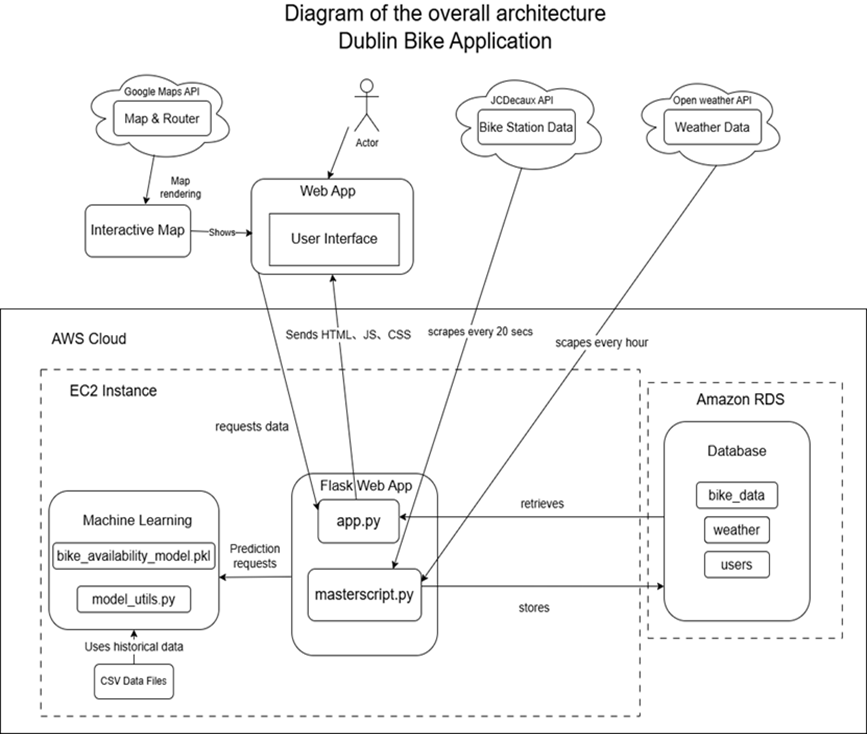

# 🚀Dublin-Bike-app 🚲

**Dublin-Bike-app** is a ✨ fantastic ✨ web application designed to help users **visualize and explore real-time and historical data** for Dublin's public bicycle system. Whether you're a commuter, tourist, or city planner, this project provides weather-aware and station-specific insights at your fingertips! 🌦️🚲

---

## 📋 Table of Contents

- [✨ Features](#-features)
- [📊 Architecture](#-architecture)
- [🚀 Getting Started](#-getting-started)
  - [🔧 Installation](#-installation)
  - [⚙️ Configuration](#️-configuration)
- [💻 Usage](#-usage)
- [🧬 Testing](#-testing)
- [🤝 Contributing](#-contributing)
- [📝 License](#-license)
- [📧 Contact](#-contact)

---

## ✨ Features

- **🗺️ Interactive Station Map**: Browse all Dublin bike stations with custom filters, search, availability indicators, and real-time updates. 🗺️
- **🌤️ Live Weather Forecasts**: View current, hourly, and weekly weather powered by OpenWeather API. 🌦️
- **🔮 Station Availability Prediction**:
  - Predict availability for any specific station at a **custom time**.
  - Generate a **12-hour future availability trend** chart.
- **📈 Charts & Trends**: Visualize bike availability and temperature trends using Google Charts and Chart.js for live and historical insights. 📈
- **🔐 User Authentication**:
  - Secure login/logout and registration with hashed passwords.
  - Support for **password reset**, **session management**, and **account dashboard**.
- **💬 User Feedback Form**:
  Users can submit feedback directly through the website — enabling engagement and continuous improvement.
- **📡 RESTful APIs**: Flask routes serve station and weather data from a MySQL backend.

- **Modular Code Structure**: Organized Flask back-end with clearly separated APIs and front-end modules. 🧱

---

## 📊 Architecture

The following diagram illustrates the high-level system design:

## 

## 🚀 Getting Started

### 🔧 Installation

To get started with **Dublin-Bike-app**, follow these steps:

1. Clone the repository:

   ```bash
   git clone https://github.com/Ruiqi-programer/Bike-app-repository.git
   cd Bike-app-repository
   ```

2. **Set up environment**:

   ```bash
   conda env create -f environment.yml
   conda activate base
   ```

### ⚙️ Configuration

All sensitive keys are stored via environment variables. Sample keys:

```env
# Bike and weather APIs
JCDECAUX_API_KEY=xxxxxxxxxxxx
OPENWEATHER_API_KEY=xxxxxxxxxxxx
GOOGLE_MAPS_API_KEY=xxxxxxxxxxxx

# DB config (optional for local dev)
DB_CONFIG={
  "host": "127.0.0.1",
  "user": "root",
  "password": "",
  "database": "dublinbike",
  "port": 3306
}
```

---

## 💻 Usage

Start your Flask application:

```bash
flask run
```

Then navigate to `http://localhost:5000/` to use the app.

---

## 🤝 Contributing

We welcome contributions! 🎉

```bash
git checkout -b feature/your-feature-name
# make your changes
git commit -m "Add your awesome feature"
git push origin feature/your-feature-name
```

Then open a pull request! 🚀

---

## 📝 License

This project is licensed under the **MIT License**.

---

## 📧 Contact

- **Email**: shuangning.wei@ucdconnect.ie 📩
- **GitHub Issues**: [Open an Issue](https://github.com/Ruiqi-programer/Bike-app-repository/issues) 🐛

---

Made with ❤️ by Shuangning Wei(https://github.com/Shelly892) and Ruiqi Guo(https://github.com/Ruiqi-programer). Happy coding! 🎉
